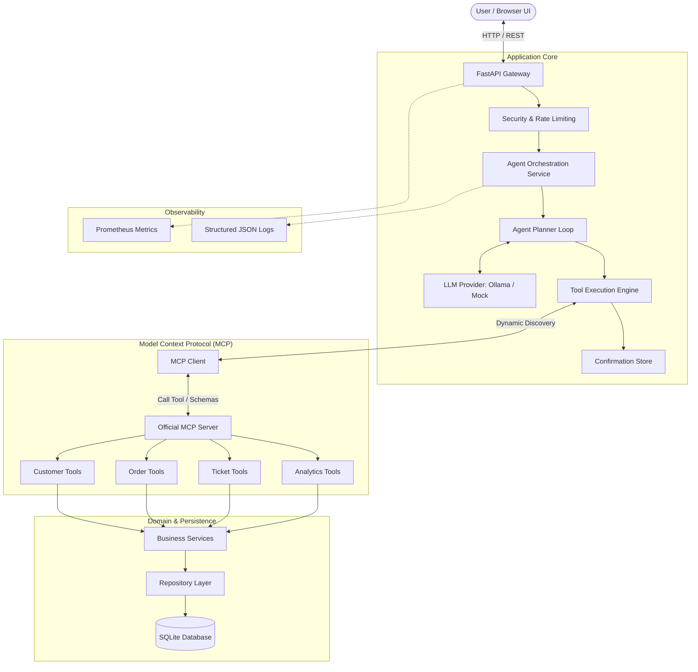

# Integration Copilot — AI-Powered Business API Assistant

[](https://github.com/your-username/integration-copilot/actions)
[](https://www.python.org/downloads/)
[](https://fastapi.tiangolo.com)
[](https://modelcontextprotocol.io/)
[](https://ollama.ai)
[](LICENSE)
[](tests/)

> A **production-style portfolio project** demonstrating an AI-powered integration assistant that uses a local LLM, tool calling, and Anthropic's **Model Context Protocol (MCP)** to securely interact with business APIs and databases through structured backend services.

---

## 1. What is this?

**Integration Copilot** is a full-stack, local-first AI assistant engineered to safely bridge natural language queries to relational databases and enterprise business workflows. 

Instead of an unconstrained chatbot or a naive prototype that dumps raw SQL into an LLM prompt, Integration Copilot implements an **agentic loop** where:
1. The user asks a question in plain English.
2. The agent queries an **MCP Server** to dynamically discover available business capabilities.
3. The LLM selects the appropriate tool and formats validated arguments.
4. The backend executes parameterized operations against a deterministic SQLite database.
5. High-consequence write operations (such as drafting support tickets or creating orders) are **intercepted** by a confirmation engine, requiring explicit human approval before any database state mutation occurs.

---

## 2. Why I Built It

Most AI demos in job applications are trivial wrapper scripts around commercial APIs (OpenAI/Anthropic) with direct SQL generation or uncontrolled autonomous tool execution. Real enterprise software requires:
- **Zero data exfiltration**: Running entirely locally on company infrastructure without third-party cloud API costs.
- **Protocol standardization**: Using an open standard (**Model Context Protocol**) rather than proprietary function-calling dictionaries.
- **Safety & Governance**: Preventing autonomous models from destructively modifying business databases without a human in the loop.
- **Full Observability & Evaluation**: Measuring tool-selection accuracy, anti-hallucination behavior, and end-to-end latency with Prometheus metrics and structured logging.

I built this project to demonstrate the architectural discipline, backend engineering, and safety guardrails required to take generative AI from a proof-of-concept into a reliable software system.

---

## 3. High-Level Architecture



---

## 4. Understanding Model Context Protocol (MCP) Simply

### Traditional Function Calling vs. MCP

```
Without MCP:
User -> LLM -> Custom Python Dicts -> Hardcoded App Logic -> DB

With MCP:
User -> LLM App -> MCP Client -> Standardized MCP Server -> Typed Tools -> DB
```

- **Without MCP**: Every developer formats ad-hoc JSON schemas for every specific LLM vendor. If you switch models or integrate with IDE assistants, you must rewrite the tool definitions.
- **With MCP**: Tools are defined once as an open-standard server. The client dynamically queries `list_tools()` at runtime. The same MCP server powering this assistant can be attached to Claude Desktop, Antigravity IDE, or any other MCP-compliant client.
- **Important Note**: MCP does not magically make an AI model smarter. Rather, it **standardizes how models discover, validate, and execute external tools and context**.

---

## 5. Key Features

- **100% Free & Local-First**: Runs entirely on your local machine using **Ollama** (`qwen3:4b` or any instruct model) and **SQLite**. Zero subscriptions, credit cards, or cloud accounts required.
- **Official MCP Server**: Implements 13 production tools across Customers, Orders, Tickets, and Analytics using the official Python MCP SDK.
- **Human-in-the-Loop Confirmation**: Consequential write operations (`create_support_ticket`, `create_order`, etc.) are intercepted. A one-time cryptographic confirmation token is issued and rendered in the UI for user approval before execution.
- **Loop Protection & Guardrails**: Hard limit of `MAX_AGENT_STEPS = 8` prevents runaway loops, while strict system prompt grounding eliminates hallucinations.
- **Layered Backend Architecture**: Clean separation between API routes, Domain Services, Repositories, MCP Tools, and Database Models.
- **Automated AI Evaluation Suite**: Includes 16 reproducible benchmark scenarios testing tool selection, parameter extraction, confirmation compliance, and anti-hallucination.
- **Production Observability**: Structured JSON logging with `request_id` and `execution_id`, plus Prometheus metrics exported at `/metrics`.
- **Modern Responsive Web UI**: Glassmorphic dark-mode web interface with real-time tool execution traces, confirmation cards, and service health status.

---

## 6. Technology Stack

| Layer | Technologies Used | Why Chosen |
|---|---|---|
| **Backend Framework** | **Python 3.11+, FastAPI** | High-performance async runtime, automatic OpenAPI documentation, clean dependency injection. |
| **Data Validation** | **Pydantic v2** | High-speed type validation, parsing, and JSON Schema generation. |
| **ORM & Database** | **SQLAlchemy 2.0, Alembic, SQLite** | Type-safe queries, migration tracking, zero configuration, zero cost local persistence. |
| **Model Context Protocol** | **Official Python MCP SDK (`mcp>=2.0.0`)** | Industry-standard protocol for tool and resource exposure. |
| **Local LLM Engine** | **Ollama (`qwen3:4b`)** | Free, open-weight local inference with OpenAI-compatible tool-calling support. |
| **Testing & Quality** | **pytest, pytest-cov, pytest-asyncio, Ruff, mypy** | Deterministic unit tests (85% coverage), strict linting, and type checking. |
| **Observability** | **prometheus-client, Python logging** | Standardized Prometheus counters/histograms and correlation-ID JSON logging. |
| **DevOps & Containers** | **Docker, Docker Compose, GitHub Actions** | Reproducible multi-platform builds and automated CI pipelines. |

---

## 7. Project Structure

```text
integration-copilot/
├── app/                        # Main application package
│   ├── main.py                 # FastAPI application initialization & lifespan
│   ├── api/                    # REST API routes & dependency injection
│   │   ├── dependencies.py     # Session & service dependency providers
│   │   └── routes/             # Endpoints (customers, orders, tickets, agent, health, metrics)
│   ├── agent/                  # Agent reasoning loop & orchestration
│   │   ├── agent.py            # AgentService coordinator
│   │   ├── planner.py          # Multi-step reasoning loop & step guardrails
│   │   ├── tool_executor.py    # Tool interceptor & safe execution traces
│   │   ├── confirmation.py     # Cryptographic token-gated confirmation store
│   │   ├── prompts.py          # Grounded system prompts & safety constraints
│   │   └── schemas.py          # Agent request/response Pydantic models
│   ├── llm/                    # Decoupled LLM provider abstraction
│   │   ├── base.py             # LLMProvider abstract interface & message models
│   │   ├── ollama_provider.py  # Local Ollama HTTP client with exponential backoff
│   │   ├── mock_provider.py    # Deterministic rule-based LLM for CI & tests
│   │   └── factory.py          # Provider factory (Ollama vs Mock)
│   ├── mcp/                    # Client integration with MCP
│   │   ├── client.py           # In-memory MCP client with timing instrumentation
│   │   └── schemas.py          # Tool schema conversion adapters
│   ├── services/               # Business logic & transaction boundaries
│   ├── repositories/           # SQLAlchemy ORM data access layers
│   ├── models/                 # SQLAlchemy 2.0 relational models
│   ├── schemas/                # Public Pydantic API schemas
│   ├── db/                     # Database engine & Alembic migrations
│   ├── core/                   # Security, configuration, logging, metrics, error handling
│   └── static/                 # Frontend Web UI (HTML, CSS, Vanilla JS)
├── mcp_server/                 # Official MCP Server
│   ├── server.py               # MCPServer instance & tool registration
│   ├── schemas.py              # Tool input/output schemas
│   └── tools/                  # 13 Business tools (customers, orders, tickets, analytics)
├── evaluation/                 # AI Agent behavioral evaluation suite
│   ├── cases.yaml              # 16 benchmark evaluation test cases
│   └── runner.py               # Benchmark execution harness & metrics reporter
├── tests/                      # Automated test suite (52 tests, 85% coverage)
│   ├── unit/                   # Unit tests (models, repositories, services, MCP tools)
│   ├── integration/            # API integration tests (FastAPI TestClient)
│   └── agent/                  # Agent loop, confirmation, & error guardrail tests
├── scripts/                    # Database seeding & administration
│   ├── seed_db.py              # Deterministic database population
│   └── reset_db.py             # Database wipe & re-migration
├── docs/                       # Comprehensive documentation suite
│   ├── architecture.md         # Detailed architectural design & Mermaid diagrams
│   ├── mcp.md                  # MCP protocol, server, and client documentation
│   ├── agent.md                # Agent reasoning loop & confirmation state machine
│   ├── how-it-works.md         # Beginner-to-advanced technical walkthrough
│   ├── interview-guide.md      # 25+ interview questions & deep-dive pitch
│   ├── demo.md                 # 5-minute live presentation script
│   ├── security.md             # Threat model, token validation, & rate limiting
│   ├── evaluation.md           # Benchmark cases, methodology, and metrics
│   ├── cloud-deployment.md     # Theoretical AWS architecture mapping
│   └── screenshots/            # Portfolio screenshot guides
├── .github/workflows/ci.yml    # GitHub Actions automated test & build workflow
├── Dockerfile                  # Production container definition
├── docker-compose.yml          # Local multi-service orchestration
├── pyproject.toml              # Build metadata, Ruff, & Mypy configurations
├── requirements.txt            # Production dependencies
└── README.md                   # This documentation
```

---

## 8. Quickstart: Running Locally on Windows PowerShell

### Step 1: Clone and Set Up Python Environment
```powershell
git clone https://github.com/your-username/integration-copilot.git
cd integration-copilot

# Create virtual environment with Python 3.11 or 3.12
python -m venv .venv
.venv\Scripts\Activate.ps1

# Install dependencies in editable mode
pip install -e ".[dev]"
```

### Step 2: Configure Environment
Copy the sample environment file:
```powershell
cp .env.example .env
```
Default configuration points to local SQLite (`data/app.db`) and local Ollama (`http://localhost:11434`).

### Step 3: Run Migrations and Deterministic Seed Data
```powershell
# Run Alembic migrations
alembic upgrade head

# Populate deterministic database (30 customers, 50 products, 100 orders, 30 tickets)
python scripts/seed_db.py
```

### Step 4: Start Ollama (Local AI Engine)
In a separate terminal:
```powershell
# Download the small, capable instruct model
ollama pull qwen3:4b

# Start Ollama
ollama serve
```

*(Note: If you wish to test the system immediately without downloading Ollama, set `LLM_PROVIDER=mock` in `.env` to use the built-in deterministic provider).*

### Step 5: Start Integration Copilot
```powershell
uvicorn app.main:app --reload --port 8000
```
Open your browser to:
- **Web UI**: [http://localhost:8000](http://localhost:8000)
- **Interactive Swagger API Docs**: [http://localhost:8000/docs](http://localhost:8000/docs)
- **Prometheus Metrics**: [http://localhost:8000/metrics](http://localhost:8000/metrics)

---

## 9. Running with Docker

You can build and run the entire application containerized:

```bash
# Build and run container
docker compose up --build
```
Access the application at `http://localhost:8000`. By default, the container communicates with Ollama running on your host machine via `host.docker.internal:11434`.

---

## 10. Example Conversations & Walkthroughs

### 1. Read Query with Automatic MCP Tool Execution
**User**: *"Show me all failed orders."*
- **Agent Flow**:
  1. Agent prompts LLM with available MCP tools.
  2. LLM selects `search_orders` with argument `{"status": "FAILED"}`.
  3. MCP Server executes query against SQLite database.
  4. LLM receives 8 failed order records and synthesizes response.
- **Assistant**:
  > *"I found 8 failed orders in the database. The latest one is ORD-1005 for customer CUST-1004 totaling $249.99..."*
- **Execution Details Accordion**:
  - `Tool: search_orders` | `Duration: 14ms` | `Status: success` | `Results: 8`

---

### 2. Human Confirmation for Write Operations
**User**: *"Create a high priority support ticket for customer CUST-1004 saying their order is delayed."*
- **Agent Flow**:
  1. LLM selects `create_support_ticket`.
  2. `ToolExecutor` flags this as a **WRITE** tool. Execution is paused.
  3. A single-use confirmation token is generated with a 10-minute expiration.
  4. The UI renders an action confirmation card.
- **UI Displays**:
  ```text
  Pending Action Confirmation:
  - Tool: create_support_ticket
  - Customer ID: CUST-1004
  - Priority: HIGH
  - Title: Order is delayed
  [ Confirm Action ]  [ Cancel ]
  ```
- **User Clicks [Confirm Action]**:
  - The token is redeemed and deleted to prevent replay.
  - The ticket is inserted into SQLite.
  - The assistant confirms creation of ticket `TCK-1031`.

---

## 11. Automated Evaluation Suite

The repository includes a benchmark harness measuring agent reasoning accuracy:

```powershell
python -m evaluation.run
```

### Verified Benchmark Results (16 Benchmark Scenarios):
```text
=======================================================
  EVALUATION SUMMARY REPORT
=======================================================
  Total Test Cases           : 16
  Passed                     : 16
  Failed                     : 0
  Pass Rate                  : 100.0%
  Tool Selection Accuracy    : 100.0%
  Confirmation Cases Tested  : 4
  Confirmation Compliance    : 100.0%
  Anti-Hallucination Rate    : 100.0%
  Total Benchmark Duration   : 0.06s
=======================================================
```

---

## 12. Testing & Quality Verification

Run the comprehensive automated test suite (52 tests):

```powershell
# Run all unit, integration, and agent tests with coverage
pytest --cov=app --cov=mcp_server

# Run code linter
ruff check .

# Run code formatter check
ruff format --check .

# Run static type checker
mypy app
```

---

## 13. Security & Governance Design

- **Zero Autonomous Writes**: Write tools cannot modify state without an authenticated, unexpired confirmation token.
- **SQL Injection Prevention**: All queries are parameterized via SQLAlchemy ORM; no dynamic SQL concatenation.
- **Sliding-Window Rate Limiting**: 30 requests/minute per client IP to safeguard against DoS attacks.
- **Loop Termination Safeguards**: Hard execution limit (`MAX_AGENT_STEPS = 8`) prevents infinite agent reasoning loops.
- **Safe Information Disclosure**: Errors return sanitized envelopes with correlation IDs (`request_id`); internal database stack traces are never leaked.

---

## 14. Troubleshooting

| Issue | Cause | Solution |
|---|---|---|
| `ConnectionRefusedError: [Errno 111] connect` | Ollama service is not running | Start Ollama using `ollama serve` or set `LLM_PROVIDER=mock` in `.env`. |
| `HTTP 401 Unauthorized` | Missing or invalid Bearer token | Supply header `Authorization: Bearer development-token` in requests. |
| `HTTP 429 Too Many Requests` | Exceeded rate limit | Wait 60 seconds or adjust `RATE_LIMIT_REQUESTS_PER_MINUTE` in `.env`. |
| `OperationalError: no such table` | Database migrations not applied | Run `alembic upgrade head` and `python scripts/seed_db.py`. |

---

## 15. Resume Bullets (Based on Implemented Features)

- *Architected a production-style business integration assistant using Python, FastAPI, Ollama, and Model Context Protocol (MCP), enabling local LLMs to discover and execute 13 validated business tools.*
- *Implemented a secure agent orchestration engine featuring multi-step reasoning, human-in-the-loop confirmation tokens for write mutations, sliding-window rate limiting, and loop guardrails.*
- *Engineered an automated AI evaluation framework testing tool selection and anti-hallucination behavior, backed by 52 deterministic unit/integration tests with 85% code coverage, Prometheus metrics, and GitHub Actions CI.*

---

## 16. License

This project is licensed under the MIT License - see the [LICENSE](LICENSE) file for details.
