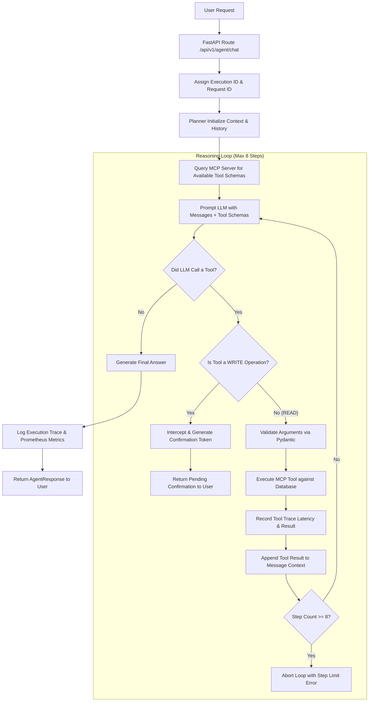
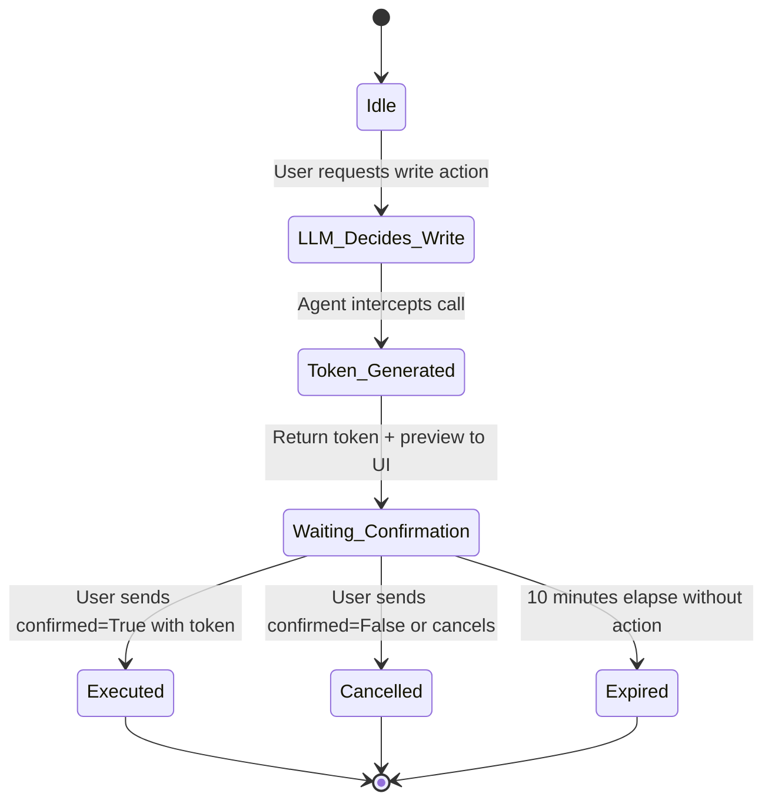

# AI Agent Architecture & Orchestration

## 1. Core Workflow

The agent orchestrates natural language requests through an iterative reasoning and tool execution loop:

---

## 2. Deterministic vs. LLM-Driven Division of Labor

A critical principle of this architecture is **not relying on the LLM for tasks that require strict determinism**:

| Responsibility | Controlled By | Why? |
|---|---|---|
| **Intent Understanding** | LLM | Handles synonyms, typos, varied phrasing ("Show failed orders", "Any broken transactions?") |
| **Tool Selection** | LLM | Matches user goal against descriptive MCP tool schemas |
| **Argument Extraction** | LLM | Extracts entities (`CUST-1004`, `status="FAILED"`, `limit=5`) from text |
| **Argument Validation** | Deterministic Code (Pydantic) | Guarantees types, regex patterns, valid dates, and positive numbers before execution |
| **Database Transactions** | Deterministic Code (SQLAlchemy) | ACID transactions, constraint checks, and database security |
| **Write Permission & Confirmation** | Deterministic Code (Agent Engine) | Cryptographic token creation and verification prevents unauthorized autonomous writes |
| **Loop Guardrails** | Deterministic Code (Planner) | `MAX_AGENT_STEPS = 8` hard cap prevents infinite loops or cost runaways |
| **Response Synthesis** | LLM | Synthesizes raw tool outputs into concise, professional business responses |

---

## 3. Human Confirmation State Machine

Write operations (`create_support_ticket`, `update_support_ticket`, `create_order`, `update_order_status`) must never be autonomously performed by the model.

### Protection Against Replay & Tampering
- Each token is a cryptographically random UUID generated in `app/agent/confirmation.py`.
- The token stores the exact tool name and validated arguments.
- Tokens have a 10-minute TTL (`expires_at`).
- Tokens are **single-use**; once consumed, they are invalidated to prevent replay attacks.
- If a user attempts to alter the parameters during confirmation, the backend rejects it.

---

## 4. Multi-Step Workflows

The agent natively handles compound goals:
**Example**: *"Find failed orders for customer CUST-1004 and create a high-priority support ticket for the latest one."*

1. **Step 1 (READ)**:
   - LLM calls `get_customer_orders(customer_id="CUST-1004")`.
   - Tool returns customer orders, including `ORD-1012` with status `FAILED`.
2. **Step 2 (WRITE)**:
   - LLM inspects the result and calls `create_support_ticket(customer_id="CUST-1004", order_id="ORD-1012", priority="HIGH", ...)`.
   - The engine intercepts the call, creates a confirmation token, and presents the draft ticket to the user.
3. **Step 3 (CONFIRMATION)**:
   - User approves the ticket creation.
   - The engine executes the write tool, generates `TCK-1031`, and returns the final response.

---

## 5. Anti-Hallucination Guardrails

The system employs strict grounding rules embedded in `app/agent/prompts.py`:
1. **Explicit Grounding**: The model must only state facts retrieved from tool calls.
2. **No Data Invention**: If a tool returns no matches (e.g. `customer_not_found`), the agent must state that the customer was not found rather than inventing an ID or name.
3. **Transparent Execution Traces**: Every tool used is recorded in `tool_trace` with timestamps and duration, allowing users to verify the data provenance.
