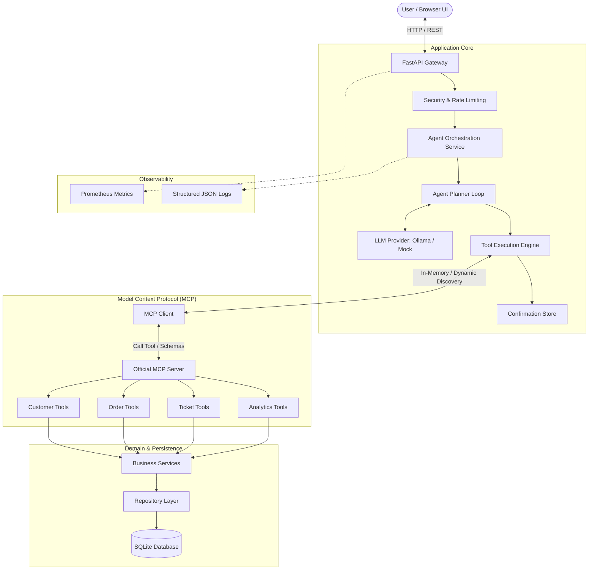
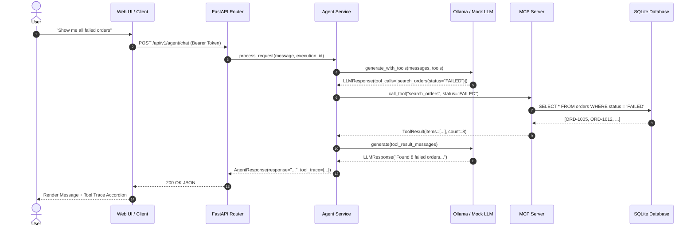
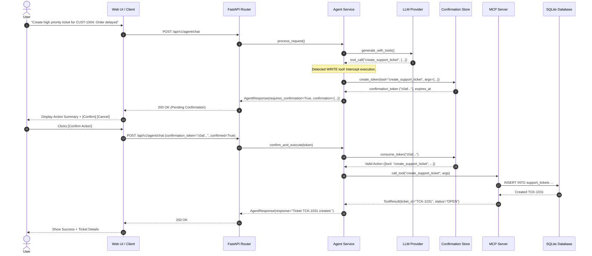
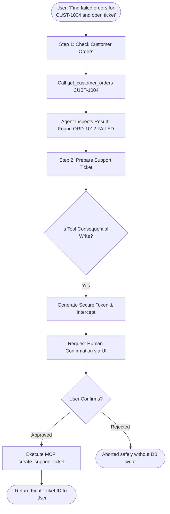
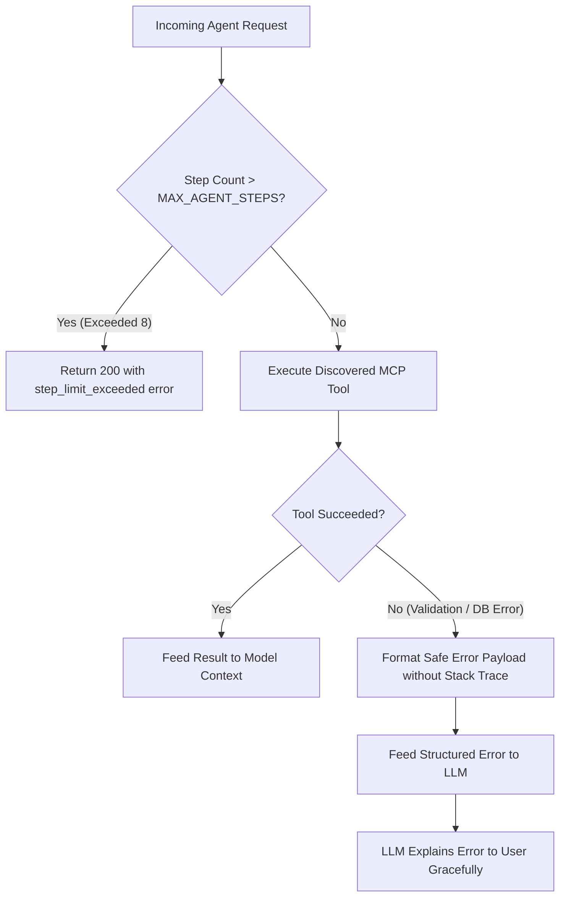

# System Architecture

## Overview

**Integration Copilot** is built upon a layered, decoupled architecture designed to bridge natural language requests to structured business operations with zero cloud dependencies. It demonstrates how modern AI applications can safely interact with core enterprise services through standardized protocols, strict type validation, and human-in-the-loop safeguards.

---

## Architectural Layers & Separation of Concerns

1. **API Layer (`app/api/`)**:
   - Exposes RESTful endpoints for CRUD operations and AI interactions.
   - Handles HTTP serialization, status codes, query parameter validation, and rate limiting (sliding window 30 req/min).
   - Injects dependencies (database sessions, domain services, security principals).

2. **Agent Layer (`app/agent/`)**:
   - Orchestrates multi-step reasoning without allowing the model direct database access.
   - Manages execution limits (`MAX_AGENT_STEPS = 8`) to guarantee termination.
   - Detects high-consequence write operations and enforces cryptographic confirmation tokens.

3. **LLM Provider Layer (`app/llm/`)**:
   - Abstract interface (`LLMProvider`) decoupling the agent from specific model backends.
   - Implementations:
     - `OllamaProvider`: Local inference over HTTP with exponential backoff retries.
     - `MockLLMProvider`: Deterministic, zero-network rule-based provider for CI/CD and unit testing.

4. **MCP Layer (`app/mcp/` & `mcp_server/`)**:
   - Standardized tool abstraction using the official Python MCP SDK.
   - Exposes 13 validated business tools with strict JSON schemas.
   - Client dynamically queries the server for tools rather than hardcoding function signatures.

5. **Service Layer (`app/services/`)**:
   - Houses business logic, invariants, and transaction boundaries.
   - Calculates order totals, validates stock, and handles entity transitions.

6. **Repository Layer (`app/repositories/`)**:
   - Isolates SQLAlchemy ORM queries and database access patterns.
   - Implements parameterized filters, sorting, and pagination.

7. **Database Layer (`app/models/` & `app/db/`)**:
   - SQLAlchemy 2.0 declarative models.
   - Alembic schema migrations.
   - Deterministic relational schema across Customers, Products, Orders, Order Items, and Support Tickets.

8. **Observability Layer (`app/core/logging.py`, `app/core/metrics.py`)**:
   - Request-scoped tracking (`request_id` and `execution_id`).
   - Standardized structured JSON output.
   - Prometheus metrics endpoint at `/metrics`.

---

## Key System Flows

### 1. Read-Only Query Flow

### 2. Human-in-the-Loop Write Confirmation Flow

### 3. Multi-Step Workflow

### 4. Error Handling & Guardrail Protection

