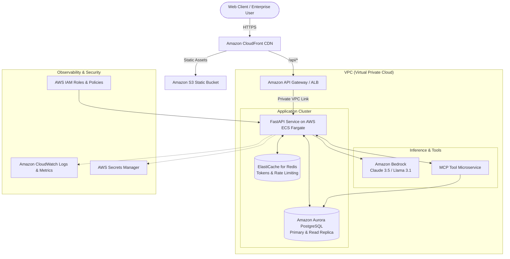

# Theoretical Cloud Architecture (AWS Deployment Guide)

> **Important Note**: This document outlines a theoretical enterprise deployment on Amazon Web Services (AWS) for system design discussions and architectural evaluation. The primary **Integration Copilot** project runs 100% locally for free with zero cloud dependencies.

---

## 1. Local-to-Cloud Component Mapping

| Local Component | Production AWS Equivalent | Purpose & Architectural Rationale |
|---|---|---|
| **FastAPI Backend** | **AWS ECS (Fargate) or AWS Lambda + API Gateway** | Containerized FastAPI workers auto-scaled based on CPU/Memory and HTTP request volume. |
| **SQLite (`data/app.db`)** | **Amazon RDS PostgreSQL (Multi-AZ) / Aurora Serverless v2** | Highly available relational database with automated backups, read-replicas, and connection pooling. |
| **Confirmation Store (In-Memory)** | **Amazon ElastiCache for Redis / DynamoDB with TTL** | Distributed, sub-millisecond storage for confirmation tokens and rate limiting across multiple backend tasks. |
| **Ollama Local LLM** | **Amazon Bedrock (Claude 3.5 / Llama 3) or AWS SageMaker JumpStart** | Managed enterprise LLM API with private VPC endpoints, IAM authorization, and SOC2 compliance. |
| **MCP Server (In-Process)** | **AWS ECS Private Microservice or AWS Lambda** | Isolated, internal tool-execution microservice communicating over private VPC networking. |
| **Structured JSON Logs** | **Amazon CloudWatch Logs + Insights** | Centralized log aggregation, real-time alerting, and query analytics. |
| **Prometheus Metrics (`/metrics`)** | **Amazon Managed Service for Prometheus (AMP) + Grafana** | Scalable metrics storage and operational visualization dashboards. |
| **Static Web UI** | **Amazon S3 + CloudFront CDN** | Globally distributed, low-latency static hosting with HTTPS and DDoS mitigation. |
| **Secrets (`.env`)** | **AWS Secrets Manager / AWS Systems Manager Parameter Store** | Encrypted secret storage with automated rotation and fine-grained IAM policies. |

---

## 2. Target AWS Architecture Diagram

---

## 3. Detailed Cloud Component Breakdown

### 1. Ingress & Routing: Amazon CloudFront & API Gateway
- **CloudFront** handles TLS termination, caching of static frontend files (`index.html`, `styles.css`, `app.js`), and shields against DDoS attacks via AWS Shield Standard.
- Routes `/api/*` traffic to an **Application Load Balancer (ALB)** or **HTTP API Gateway**, which validates JWT tokens via an authorizer lambda before forwarding to ECS.

### 2. Compute Layer: AWS ECS on AWS Fargate
- Runs the containerized application (`Dockerfile`) without managing underlying EC2 instances.
- **Autoscaling**: Scaled horizontally between 2 and 20 tasks using target tracking policies based on ALB request count per target and CPU utilization.
- Health checks: ALB pings the `/health` and `/ready` endpoints to manage healthy container lifecycles.

### 3. Database Layer: Amazon Aurora PostgreSQL
- Replaces SQLite for concurrent enterprise workloads.
- Storage scales automatically up to 128 TiB.
- Read replicas handle analytical queries (`GET /api/v1/analytics/*`), shielding write transactions from analytical load.

### 4. Distributed State & Rate Limiting: Amazon ElastiCache (Redis)
- **Token Store**: Confirmation tokens are stored as Redis keys with `SETEX confirmation:<token> 600 <payload>`. Redis natively expires unconfirmed tokens after 10 minutes.
- **Sliding-Window Rate Limiting**: Implemented via Redis sorted sets with atomic pipelining to support thousands of requests per second across all ECS replicas.

### 5. AI Inference: Amazon Bedrock
- Replaces local Ollama with a managed cloud inference endpoint.
- Provides enterprise data protection: prompts and completions are never logged or used to train foundation models.
- Integrates with the existing `LLMProvider` interface by adding an `AmazonBedrockProvider` using `boto3`.

### 6. Security & Identity: AWS IAM & Secrets Manager
- Tasks assume an **IAM Task Role** granting minimal privileges:
  - `secretsmanager:GetSecretValue` for database credentials.
  - `bedrock:InvokeModel` for model inference.
  - `rds-db:connect` for IAM database authentication.
- Secrets are automatically injected into the container environment at startup.
