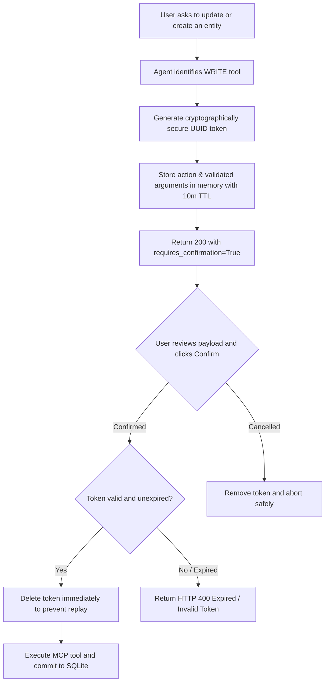

# Security Architecture & Controls

This document details the security posture, threat model, and defense-in-depth controls implemented across **Integration Copilot**.

---

## 1. Threat Modeling & Mitigations

| Threat Category | Potential Attack Vector | System Defense |
|---|---|---|
| **Autonomous Model Writes** | Model attempts to delete or alter database records based on prompt injection or hallucination. | **Human-in-the-Loop Confirmation**: All WRITE tools are intercepted by `ToolExecutor`. A cryptographically random confirmation token is issued; the database remains untouched until explicit user confirmation is submitted. |
| **SQL Injection** | Malicious payloads injected into query filters (e.g. `' OR '1'='1`). | **SQLAlchemy ORM Parameterization**: All queries use typed SQLAlchemy ORM filters. Zero raw SQL string concatenation is permitted. |
| **Denial of Service (DoS)** | Client floods the API with high-frequency agent requests or recursive tool loops. | **Sliding Window Rate Limiter**: 30 requests/minute per client IP.<br>**Loop Protection**: `MAX_AGENT_STEPS = 8` hard cap on agent reasoning steps. |
| **Replay & Token Tampering** | Attacker intercepts a confirmation token and replays it or alters the payload arguments. | **Single-Use Tokens with Ephemeral TTL**: Confirmation tokens expire after 10 minutes and are deleted immediately upon redemption. Arguments are bound to the token and cannot be modified at confirmation time. |
| **Sensitive Data Exposure** | Stack traces or database error messages leaked in API error responses. | **Centralized Error Sanitization**: Handled in `app/core/errors.py`. Responses return standard structured JSON with a unique `request_id` without exposing internal tracebacks. |
| **Credential Leakage** | Hardcoding API keys or database connection strings in source code. | **Environment Variable Isolation**: Pydantic Settings reads configuration from `.env`. Sensitive variables are documented in `.env.example` and excluded via `.gitignore`. |

---

## 2. Authentication & Authorization Architecture

### Local Bearer Token Authentication
The API enforces authentication through standard HTTP Authorization headers:
```http
Authorization: Bearer <API_AUTH_TOKEN>
```
Configured via `API_AUTH_TOKEN` in `app/core/config.py`.

### Role-Based Access Control (RBAC)
The security dependency (`app/core/security.py`) constructs a `UserPrincipal`:
- `Role.USER`: Can query all read-only endpoints (Customers, Orders, Tickets, Analytics, Agent chat).
- `Role.ADMIN`: Required for privileged direct mutations or administrative operations.

> **Production Note**: In enterprise environments, this local Bearer token mechanism should be replaced with an OAuth2 / OpenID Connect (OIDC) identity provider such as Keycloak, Okta, or AWS Cognito with JWT signature verification and public key caching (JWKS).

---

## 3. Human Confirmation Workflow for Write Operations



### Key Security Invariants:
1. **Zero Database Writes Pre-Confirmation**: The database session is never opened for write tools prior to confirmation.
2. **Immutable Arguments**: The arguments executed are those that were cryptographically signed and stored in the token—not re-supplied by the client.
3. **Atomic Consumption**: Token lookup and removal are atomic, neutralizing concurrent double-spending attempts.

---

## 4. Rate Limiting

Implemented in `app/core/security.py`:
- Algorithm: In-memory sliding-window timestamp tracking.
- Window: 60 seconds.
- Threshold: 30 requests per minute per IP address.
- Response on Breach: HTTP 429 Too Many Requests with `Retry-After: 60` header.

> **Production Note**: In a multi-replica clustered environment, replace in-memory tracking with a distributed Redis sliding-window counter using Redis sorted sets.

---

## 5. Input Validation & Schema Hardening

All inputs arriving at the REST API, Agent endpoints, and MCP tools are strictly validated using Pydantic:
- Customer IDs must adhere to `^CUST-\d{4}$`.
- Order IDs must adhere to `^ORD-\d{4}$`.
- Ticket IDs must adhere to `^TCK-\d{4}$`.
- Date filters are parsed into timezone-aware `datetime` objects.
- Number fields enforce minimum values (`ge=0`).
- String fields enforce length boundaries (`min_length=3, max_length=256`).
